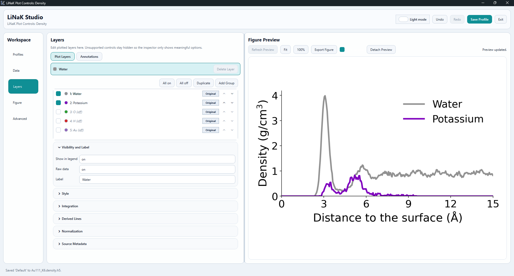

# LiNaK

**LiNaK is currently still under active development. Any bugs, feedback, or feature requests are very welcome!**

LiNaK is a lightweight Python toolkit for molecular dynamics trajectory analysis. The package is designed for electrochemical systems (e.g. a Pt(111)-surface with an electrolyte of water and cations), but many features are general-purpose and applicable to other MD contexts as well. It combines trajectory analysis, HDF5-based data storage, plotting, and a few practical CP2K/LAMMPS utilities behind one CLI.


LiNaK provides five top-level commands:
- `linak project`: open a project workspace for input management, analyses, outputs, and logs
- `linak compute`: generate LiNaK HDF5 analysis files
- `linak plot`: plot LiNaK density, MSD, RDF, position, coordination, potential, and orientation HDF5 files by auto-detecting the analysis from the HDF5 metadata
- `linak apply`: convert trajectories, pack simulation directories, apply PBC, or compress CP2K output files
- `linak hdf5` (`linak hd`, `linak h5`): inspect, combine, transform, and plot generic tabular HDF5 data

Supported inputs include:
- ASE-supported trajectory files (e.g. CP2K's `.xyz`, LAMMPS's `.dump`, etc.)
- LAMMPS and CP2K input scripts (`.lmp`, and `.inp`, respectively)
- CP2K Hartree cube files for potential analysis

LiNaK currently supports Python `3.9`, `3.10`, `3.11`, `3.12`, and `3.13`.

## Installation

Clone the repository:

```bash
git clone https://github.com/rskort/LiNaK.git
cd LiNaK
```

From the project root:

```bash
pip install .
```

Install development tools:

```bash
pip install -e .[dev]
```

## Quick Start

The recommended workflow for repeated analysis is to convert a raw trajectory
first. `linak apply convert` writes a `*.traj.h5` file that embeds cell,
timestep, fixed-atom, and surface-cache metadata so all later `linak compute`
commands can run faster and without re-reading the original text file. 

When working on **an HPC cluster**, it is recommended to convert the trajectory 
on the cluster first and then copy the much smaller HDF5 file back to the local 
machine for fast iteration with `linak compute` and `linak plot`.

```bash
linak apply convert traj.xyz
linak compute density traj.traj.h5
linak compute msd traj.traj.h5 --species O
linak compute rdf traj.traj.h5 --species-a O --species-b H
linak compute coordination traj.traj.h5 --species-a O --species-b H --cutoff-from-rdf
linak compute position traj.traj.h5 --species O
linak compute orientation traj.traj.h5
linak plot LiNaK_outputs/traj.traj_density_z.h5
linak plot LiNaK_outputs/traj.traj_rdf_o_h.h5
```

You can also run `linak compute` directly on a raw trajectory without converting first:

```bash
linak compute density traj.xyz
linak plot traj_density_z.h5

linak compute density traj.xyz --species H2O
linak plot traj_density_h2o_z.h5

linak compute msd traj.xyz --species O
linak plot traj_msd_o.h5
linak compute position traj.xyz --species O
linak plot traj_position_o_z.h5
linak compute rdf traj.xyz --species-a O --species-b H
linak plot traj_rdf_o_h.h5
linak compute coordination traj.xyz --species-a O --species-b H --cutoff-from-rdf
linak plot traj_coordination_o_h.h5
linak compute orientation traj.xyz
linak plot traj_orientation_z.h5
```

Run `linak` for information or `linak --help` for the full CLI overview.

Method documentation for the compute analyses lives under
[`docs/`](docs/README.md). Those notes explain
what each analysis actually computes, which assumptions are made, and what is
written into the HDF5 output.

Internally, the analysis layer now uses shared helper modules for common
analysis plumbing and surface estimation:
- `src/linak/analysis/common.py` for reusable species, cell, and HDF5 helpers
- `src/linak/analysis/surface.py` for the shared surface-reference estimator


Python API example:

```python
from linak.trajectory.io import read_trajectory
from linak.analysis.density import compute_density_profile
from linak.analysis.msd import compute_msd

frames = read_trajectory("traj.xyz")
density = compute_density_profile(frames, species="O", axis="z", bin_width=0.1)
msd = compute_msd(frames, species="O", timestep_fs=0.5)

print(density.species, density.units, density.n_frames)
print(msd.species, msd.msd[-1], "A^2")
```

## CLI Overview

### `linak compute`

`compute` commands read trajectories or CP2K Hartree cube files and write
LiNaK HDF5 outputs.

Available analyses:
- `density`: 1D density profiles
- `msd`: mean-squared displacement
- `position`: atom-resolved trajectories (`x`, `y`, `z`, and distance to surface) vs time
- `rdf`: radial distribution function
- `coordination`: continuous coordination number vs time and/or distance to surface
- `potential`: CP2K cSHE-related quantities from Hartree cube files
- `orientation`: H2O polar and azimuthal orientation profiles vs distance to surface

Examples:

```bash
linak compute density traj.xyz
linak compute density traj.xyz --species H2O --axis z --bin-width 0.1
linak compute msd traj.xyz --species O --timestep-fs 0.5
linak compute position traj.xyz --species O --axis z
linak compute rdf traj.xyz --species-a O --species-b H --bin-width 0.05
linak compute coordination traj.xyz --species-a O --species-b H --cutoff-from-rdf
linak compute orientation traj.xyz
linak compute potential -f run1/*-v_hartree-1_0.cube run2/*-v_hartree-1_0.cube --output potentials.h5
```

### `linak plot`

The `plot` command reads LiNaK analysis HDF5 files and auto-detects whether the
file contains density, MSD, RDF, position, coordination, potential, or orientation data.

Examples:

```bash
linak plot traj_density_z.h5
linak plot -f run1_density_z.h5 run2_density_z.h5
linak plot traj_msd_o.h5 
linak plot traj_position_o_z.h5
linak plot traj_rdf_o_h.h5 
linak plot traj_coordination_o_h.h5
linak plot traj_orientation_z.h5
linak plot potentials.h5
```

When `linak plot` cannot detect a supported LiNaK analysis in the HDF5 file, it
falls back to generic HDF5 plotting via `linak hdf5 plot`.

When interactive plotting is available, `linak plot` opens the LiNaK Studio GUI
by default. The GUI provides a live preview plus analysis-aware controls, 
allowing you to control options for analysis alongside the usual figure, axis,
legend, series, and export settings.

Potential HDF5 files open in the same Studio. The default potential plot shows
the stored `Water bulk`, `Fermi`, and `cSHE` series against `Record ID`, and
each series can optionally add a linear-fit overlay from the `Series` page.

The current Studio layout is organized as:
- `Profiles`
- `Data`
- `Layers`
- `Annotations`
- `Figure`
- `Advanced`

Named plot profiles are stored inside the HDF5 file. The `Profiles` page is
used to select, save, duplicate, rename, delete, import, and export those
profiles. Figure export lives with the preview controls.

`Layers` controls the plotted series themselves: visibility, labels, copies,
groups, normalization, uncertainty, fits, cumulative averages, integration, and
other per-layer display settings. Groups are live aggregations of their member
layers, so changing a member layer updates the group on the next preview.

`Annotations` controls figure-level overlays such as text labels, guide lines,
and arrows. These are stored in the plot profile, rendered in the live preview,
and exported with the figure.

The preview pane can also be detached into a separate live-updating window when
you want to move the figure to another monitor while keeping the editor open.

For RDF and coordination HDF5 files, `Data > Profile Selection` filters which
stored profile(s) are loaded from the HDF5. When multiple stored species
combinations exist, the GUI offers dropdowns built from the available metadata
instead of requiring free-text entry.



### `linak apply`

Available apply commands:
- `convert`: convert a trajectory into LiNaK trajectory HDF5 (`*.traj.h5`)
- `pbc`: wrap atom positions into an orthorhombic periodic cell
- `compress`: extract structured files from one CP2K `.out` file

Examples:

```bash
linak apply convert traj.xyz
linak apply convert traj.xyz --input input.inp
linak apply pbc pos.xyz --cell 17.887 15.491 59.671
linak apply compress /path/to/output.out
```

Converted `*.traj.h5` files are LiNaK's canonical preprocessed trajectory
format. They store exact frame counts plus any simulation metadata LiNaK can
resolve at conversion time, including cell lengths, timestep/stride, and
fixed-atom constraints when the input declares them. When a valid cell is
available, conversion also writes PBC-wrapped coordinates and marks that
preprocessing in the trajectory metadata. Conversion always attempts to cache
the default frame-wise surface reference (`z`, `auto`, automatic surface
elements); later surface-aware `compute` commands reuse that cache when their
surface settings match and recompute only when the user requests different
settings.

Later `compute` commands prefer explicit CLI overrides first, then stored
trajectory-HDF5 metadata, then explicit/auto-detected simulation inputs.

LiNaK analysis HDF5 files use a strict development v1 schema. If an HDF5 file
was written by an incompatible LiNaK version or is missing required v1 metadata,
LiNaK rejects it and asks you to recompute the analysis with the current package.

### `linak hdf5`

The `hdf5` command group works with generic tabular HDF5 data. It supports:
- `info`, `preview`, `get`
- `sort`, `filter`, `dedupe`
- `combine` for LiNaK density/MSD/RDF/position HDF5 files
- `plot` for generic column-based plotting
- `plot-settings` for persisted plot profiles stored inside HDF5 files

Examples:

```bash
linak hdf5 info density.h5
linak hdf5 combine -f run1_density_z.h5 run2_density_z.h5
linak hdf5 plot table.h5 --kind line --x time_ps --y msd_A2
```

Many `linak hdf5` commands are semi-interactive: if required columns or options
are omitted, LiNaK can prompt with available choices.

## Analysis Notes

Detailed method notes:

- [Density](docs/density.md)
- [MSD](docs/msd.md)
- [Position](docs/position.md)
- [RDF](docs/rdf.md)
- [Coordination](docs/coordination.md)
- [Potential](docs/potential.md)
- [Orientation](docs/orientation.md)
- [Surface Estimation](docs/surface-estimation.md)
- [Water Detection And Water Geometry](docs/water-detection.md)
- [HDF5 Data Model And Metadata Conventions](docs/hdf5-data-model.md)

### Density

`linak compute density` supports:
- `--species O`: one element
- `--species H2O`: molecular water density
- `--species all`: one HDF5 file with one series per element, plus `H2O` when water is present

Cell handling for density:
- first use `--cell A B C` if provided
- then use metadata embedded in a converted `*.traj.h5` when available
- then use `--input` / `--cp2k-input` / `--lammps-input` if provided
- otherwise auto-detect a single `.inp` or `.lmp` next to the trajectory
- if no periodic cell can be resolved, LiNaK falls back to a linear density profile

Density units depend on whether a usable periodic cell is available:
- mass density: `g/Angstrom` (linear) or `g/cm^3` (volumetric)
- number density: `atom/Angstrom` (linear) or `atom/nm^3` (volumetric)

Surface-aware density profiles support `--surface-mode {auto,layered,rough}`:
- `auto` (recommended default): LiNaK inspects the structure and chooses a suitable surface reference automatically.
- `layered` (recommended for flat crystalline slabs, especially metal surfaces): LiNaK identifies the top surface layer and uses its mean height as the reference plane.
- `rough` (recommended for non-flat, reconstructed, or disordered surfaces): LiNaK tracks low-mobility surface atoms frame by frame and uses their mean position as a rough surface reference.

In all surface-aware modes, the atom-surface distance used for the density profile is computed frame by frame: LiNaK finds the surface position in one frame, shifts the atoms in that frame relative to it, and then repeats this for the next frame. The single stored `surface_position` in the HDF5 output is only a summary over those frame-wise references, not the one value used for all frames.

Use `--surface-elements` when LiNaK should only use specific atoms for surface detection, for example the metal atoms of a slab and not mobile water or ions near the interface. Generally, the automatic detection should do this correctly, but `--surface-elements` can be used to override that if needed.

### MSD

For MSD, LiNaK resolves the frame timestep in this order:
1. `--timestep-fs` if provided
2. metadata embedded in a converted `*.traj.h5` when available
3. trajectory metadata when available
4. simulation input from `--input` / `--cp2k-input` / `--lammps-input` if provided
5. auto-detected `.inp` or `.lmp` next to the trajectory
6. fallback to `0.5 fs`

When a usable periodic cell is available, MSD uses periodic minimum-image
accumulation. Otherwise it falls back to direct displacement.

### RDF

`linak compute rdf` supports `--species-a`, `--species-b`, `--r-max`,
`--bin-width`, and `--threads`. RDF requires a usable cell volume, taken from
explicit `--cell` first, then converted trajectory-HDF5 metadata, then
simulation-input resolution, then any usable cell already embedded in the
loaded trajectory frames.

### Coordination

`linak compute coordination` stores one continuous coordination-number value per
selected species-`a` atom and frame together with that atom's distance to the
surface:
- `distance_to_surface_A[T, N_a]`
- `coordination_number[T, N_a]`
- time axes (`frame`, `step`, `time_fs`, `time_ps`)

Cutoff selection for coordination supports:
- `--cutoff 3.2`: explicit cutoff in Angstrom
- `--cutoff-rdf ref_rdf.h5`: determine the cutoff from an existing RDF HDF5
- `--cutoff-from-rdf`: determine the cutoff automatically from a sampled RDF

Continuous CN uses a cosine taper around the cutoff controlled by
`--cutoff-smoothing-width` so atoms just outside the cutoff contribute less
instead of causing hard integer jumps.

When the cutoff is derived from RDF data, LiNaK samples random frame batches and
accumulates them into one convergence RDF. LiNaK then determines the first
minimum after the first RDF peak from the smoothed curve. The sampled reference
RDF is stored inside the coordination HDF5, and LiNaK also writes a diagnostic
PNG showing the raw RDF, the smoothed RDF, and the selected minimum.

### Position

`linak compute position` stores atom-resolved trajectories for each selected species:
- Cartesian coordinates `x`, `y`, `z` for every selected atom and frame
- distance to the detected surface (default: `z`-surface) for every selected atom and frame
- time axes (`frame`, `step`, `time_fs`, `time_ps`)

By default, position coordinates written to HDF5 are PBC-corrected in memory (wrapped into
the resolved periodic cell when available). Source trajectory files are not modified.

Species selection for position:
- `--species O`: one species
- omitted `--species`: LiNaK warns and computes one HDF5 file per detected species

Surface handling for position uses the same logic as density (`--surface-mode`, `--surface-elements`,
`--include-fixed-surface-atoms`), and distances are computed frame-by-frame as
`axis_coordinate - surface_position(frame)`.

Position plotting components:
- `--component distance` (default): distance to detected surface vs time
- `--component x|y|z`: Cartesian coordinate vs time
- `--component 2d-projection` (legacy alias: `xy-z`): configurable 2D trajectory projection
  - choose projection axes with `--projection-x` and `--projection-y`
  - choose the value used for colormap/filtering with `--projection-value`
  - choose `--projection-render-mode color-scale` for one colormap-driven trajectory overlay
  - choose `--projection-render-mode line-colors` for one normal layer per atom with per-layer styling
  - limit the visible data with `--projection-filter-min` and `--projection-filter-max`
  - legacy `--map-color` and `--xy-z-distance-max` still work as compatibility shims
  - default axes limits use cell dimensions (`x: 0..A`, `y: 0..B`) for legacy `xy-z` when cell data is available
  - PBC boundary jumps are rendered without artificial cross-box connector lines

### Potential

`linak compute potential` is CP2K-focused. For each Hartree cube file, LiNaK:
- searches the same directory for a suitable CP2K output file (`output.out` preferred)
- parses the Fermi level from the output file
- computes a water-bulk potential from O/H z-bounds read from the cube header
- reports `electrode_cshe_ev = water_bulk_potential_ev - efermi_ev - 0.81` by default


Output behaviour for `compute potential`:
- appends to an existing compatible HDF5 file by default
- skips sources already present in that HDF5 file
- falls back to a safe new filename if the existing schema is incompatible
- writes rows incrementally so partial progress is retained if a later source fails

Use `--strict` when a failed or incomplete source should cause a non-zero exit code.

### Orientation

`linak compute orientation` computes H2O polar and azimuthal orientation
statistics binned by distance to the detected surface. For each water molecule
in each frame, LiNaK stores:

- `cos_polar_mean`: mean cosine of the angle between the water bisector and the
  surface-normal reference axis, binned by distance to surface
- `cos_azimuthal_mean`: mean cosine of the in-plane molecular plane orientation
- density-weighted variants of both (`cos_polar_density`, `cos_azimuthal_density`)
- 2D `heatmap_polar` and `heatmap_azimuthal` arrays over distance and cosine bins

Orientation uses the same surface estimator as density, position, and
coordination. When a trusted frame-wise surface reference is available, distances
are surface-relative; otherwise the raw axis coordinate is used.

Surface options shared with density (`--surface-mode`, `--surface-elements`,
`--include-fixed-surface-atoms`, `--rough-surface-envelope`) and `--bin-width`,
`--angle-bins`, `--axis`, and `--reference-axis` are all supported.

```bash
linak compute orientation traj.xyz
linak compute orientation traj.traj.h5 --axis z --reference-axis z --bin-width 0.05
linak plot traj_orientation_z.h5
linak plot traj_orientation_z.h5 --component heatmap --angle polar
```

## Plotting and Plot Studio

For `linak plot`, the interactive Plot Studio is the default
when interactive plotting is enabled and the optional GUI dependency is
installed. Use:
- `--no-gui` for direct Matplotlib rendering
- `--no-show` for batch-style runs
- `--backend` to request a specific interactive Matplotlib backend (default is `QtAgg`, but it falls back to the best available backend if that one is not installed)

The easiest, and recommended method to change plot styles is to use the interactive controls in Plot Studio. For more advanced users, or when using `--no-gui`, LiNaK supports a wide range of CLI options to customize plot styles and settings.

`linak plot <analysis-file>.h5 -h` is also analysis-aware: when the input HDF5
cleanly resolves to one LiNaK analysis, the help view shows the shared plot
options plus only that analysis' option group. Plain `linak plot --help`
remains the full generic help view.

When multiple LiNaK HDF5 sources are plotted together, LiNaK combines the data
into a temporary or saved combined HDF5 and starts from default plot settings
rather than inheriting saved plot profiles from one input file.

For position plots specifically, `--time-section-width` can be used to
aggregate points into larger time sections for display (plot-only, source HDF5
unchanged). This applies to time-axis components (`distance`, `x`, `y`, `z`);
`2d-projection` ignores time sectioning.

For very large interactive position plots, LiNaK applies a GUI complexity guard
before opening the Studio. The most practical ways to reduce the interactive
load are:
- switch to `--component 2d-projection`
- narrow the visible projection values with `--projection-filter-min` / `--projection-filter-max`
- use `--no-gui` for direct non-interactive rendering
- use `--force-gui` only when you explicitly want to bypass the guard

Shared style controls include:
- `--figsize WIDTH HEIGHT`
- `--dpi`
- `--font-family`
- `--title-font-size`, `--label-font-size`, `--tick-font-size`
- `--line-width`, `--line-color`, `--line-colors`
- `--grid`, `--ticks`, `--markers`
- axis limits, scales, ticks, legend controls, and custom labels

Plot settings can be persisted inside HDF5 files and reused across sessions.
Use `linak hdf5 plot-settings` to inspect, edit, copy, import, or export those
saved plot profiles. Named profiles are supported per analysis key, and
`linak plot --settings-profile NAME` loads a specific saved profile instead of
the active one.

## Apply Commands

### `linak apply pbc`

PBC wrapping resolves the cell in this order:
1. `--cell A B C`
2. `--input` / `--cp2k-input` / `--lammps-input`
3. auto-detect a single `.inp` or `.lmp` in the output directory

If the trajectory file itself already contains a usable periodic cell, LiNaK uses that
without requiring an external input file.

Examples:

```bash
linak apply pbc pos.xyz
linak apply pbc pos.xyz --input input.inp --output wrapped.xyz
linak apply pbc pos.xyz --overwrite
```

### `linak apply compress`

`linak apply compress` extracts structured analysis files from one CP2K output
and then moves the raw `.out` file into a backup directory.

By default it creates:
- an output directory named after the input stem (auto-suffixed if needed)
- `README.txt`, `manifest.json`, `summary.txt`, `backup_info.txt`, CSV extracts, and text summaries
- a hidden backup directory `.linak_backups/` next to the input
- a sidecar `<backup-file>.meta.json` describing backup linkage

Useful options:
- `--backup-dir /path/to/backups`
- `--drop <section> [<section> ...]`

## Shared CLI Features

All executable subcommands support:
- `--dry-run` / `-n`
- `--log-level {DEBUG,INFO,WARNING,ERROR}`
- `--log-file <path>`

Additional shared behavior:
- compute commands write HDF5 next to the input source by default
- use `-o/--output` (alias `--save-data` on compute commands) to override output paths
- use `-f/--files` when passing multiple input files; it also works for a single file
- LiNaK records resolved cell and timestep provenance in HDF5 metadata where applicable
- when available metadata sources disagree, LiNaK logs a warning instead of silently picking one without notice

## Development

```bash
ruff check .
ruff format --check .
mypy src tests
pytest -q
```

## Contributing
Contributions are always welcome! Please open an issue or submit a pull request on GitHub.

When contributing code, please follow the existing style and conventions as much as possible. The project uses `ruff` for linting and formatting, so running `ruff check .` and `ruff format --check .` before submitting can help ensure consistency.

You can also request additions or changes by sending me an email at <r.s.kort@lic.leidenuniv.nl>.
